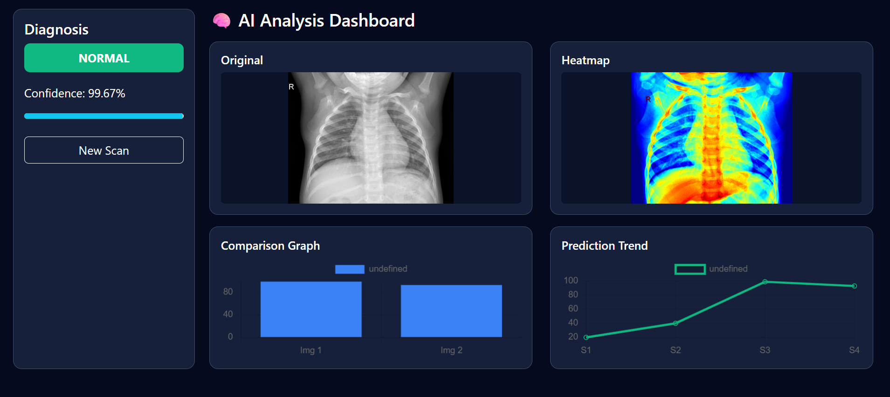
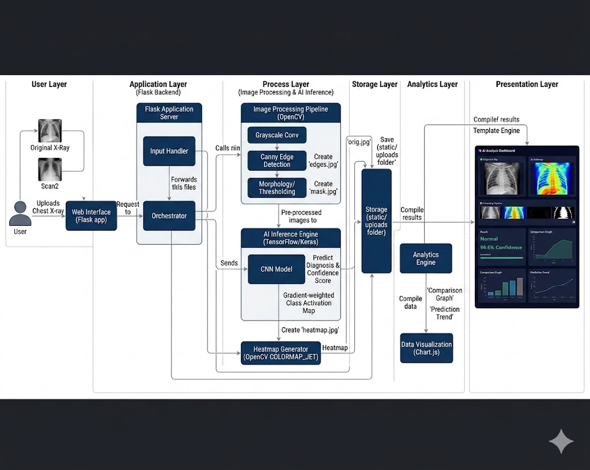

# AI Medical Image Analysis System 🩺

[](https://www.python.org/)
[](https://flask.palletsprojects.com/)
[](https://www.tensorflow.org/)

A high-performance, industry-ready application designed to assist in the early detection of **Pneumonia** using deep learning and computer vision.

## 📸 Dashboard Preview


## 🚀 Key Features
* **Automated Inference:** High-accuracy CNN-based classification of chest X-rays.
* **Explainable AI (XAI):** Generates **Heatmaps** to highlight regions of interest.
* **Interactive Dashboard:** Dark-themed UI with **Chart.js** for real-time visualization.
* **Performance Tracking:** Trend analysis of patient scan history.

## 🏗️ System Architecture


## ⚙️ Installation
1. **Clone the repository:**
   ```bash
   git clone https://github.com/dalimkumar452-sudo/AI-Medical-Image-Analysis.git
   cd AI-Medical-Image-Analysis
Setup virtual environment:

Bash
python -m venv myenv
.\myenv\Scripts\activate
Install dependencies:

Bash
pip install -r requirements.txt
Run the application:

Bash
python app.py
👨‍💻 About Me
I am Dalim Kumar, a Computer Science & Engineering  student passionate about building real-world AI solutions.
